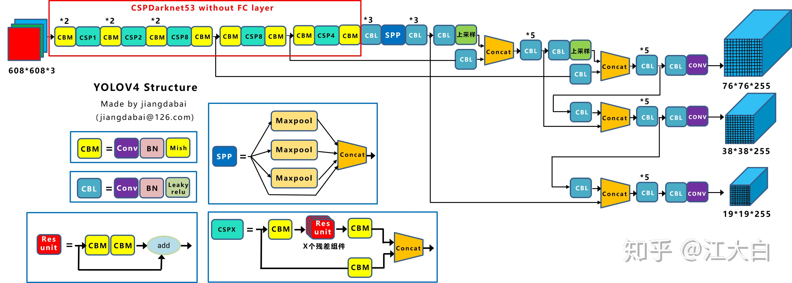
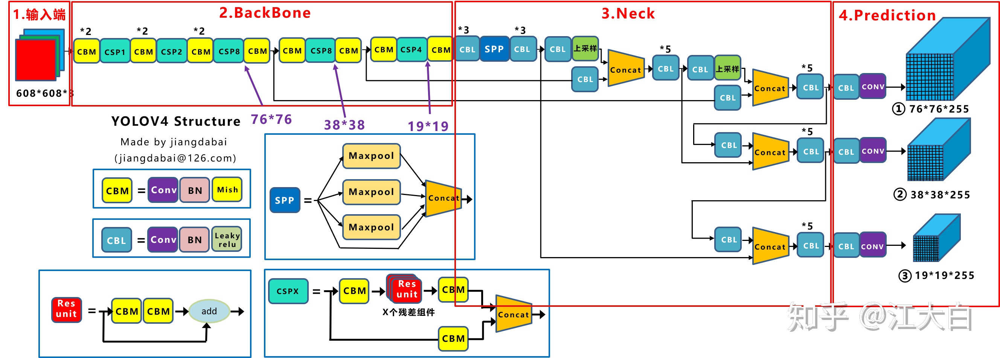
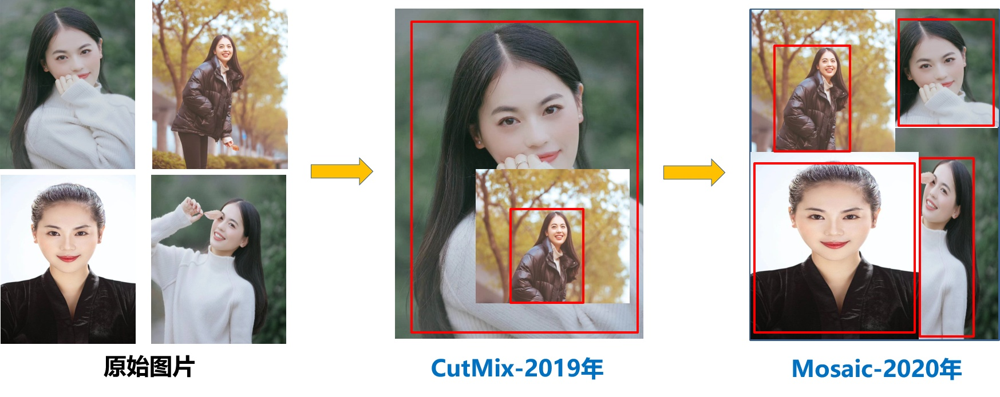

大量内容来自江大白，内容仅用于个人笔记
# 网络结构图

Yolov4的结构图和Yolov3相比，因为多了CSP结构，PAN结构，如果单纯看可视化流程图，会觉得很绕，不过在绘制出上面的图形后，会觉得豁然开朗，其实整体架构和Yolov3是相同的，不过使用各种新的算法思想对各个子结构都进行了改进。

先整理下Yolov4的五个基本组件：  
- **CBM**：Yolov4网络结构中的最小组件，由Conv+Bn+Mish激活函数三者组成。  
- CBL：由Conv+Bn+Leaky_relu激活函数三者组成。  
- Res unit：借鉴Resnet网络中的残差结构，让网络可以构建的更深。  
- **CSPX**：借鉴CSPNet网络结构，由三个卷积层和X个Res unint模块Concate组成。  
- **SPP**：采用1×1，5×5，9×9，13×13的最大池化的方式，进行多尺度融合。  

其他基础操作：  
Concat：张量拼接，维度会扩充，和Yolov3中的解释一样，对应于cfg文件中的route操作。
add：张量相加，不会扩充维度，对应于cfg文件中的shortcut操作。
Backbone中卷积层的数量：

和Yolov3一样，再来数一下Backbone里面的卷积层数量。

每个CSPX中包含3+2\*X个卷积层，因此整个主干网络Backbone中一共包含2+（3+2\*1）+2+（3+2\*2）+2+（3+2\*8）+2+（3+2\*8）+2+（3+2\*4）+1=72。

按照Yolov3设计的传统，这么多卷积层，主干网络不应该叫CSPDaeknet73吗？？？？

# 核心基础内容
Yolov4本质上和Yolov3相差不大，可能有些人会觉得失望。

但我觉得算法创新分为三种方式：  

第一种：面目一新的创新，比如Yolov1、Faster-RCNN、Centernet等，开创出新的算法领域，不过这种也是最难的
第二种：守正出奇的创新，比如将图像金字塔改进为特征金字塔
第三种：各种先进算法集成的创新，比如不同领域发表的最新论文的tricks，集成到自己的算法中，却发现有出乎意料的改进
Yolov4既有第二种也有第三种创新，组合尝试了大量深度学习领域最新论文的20多项研究成果，而且不得不佩服的是作者Alexey在github代码库维护的频繁程度。

目前Yolov4代码的star数量已经1万多，据我所了解，目前超过这个数量的，目标检测领域只有Facebook的Detectron(v1-v2)、和Yolo(v1-v3)官方代码库（已停止更新）。  

所以Yolov4中的各种创新方式，大白觉得还是很值得仔细研究的。

为了便于分析，将Yolov4的整体结构拆分成四大板块：

主要从以上4个部分对YoloV4的创新之处进行讲解，让大家一目了然。

- 输入端：这里指的创新主要是训练时对输入端的改进，主要包括**Mosaic数据增强**、cmBN、SAT自对抗训练  
- BackBone主干网络：将各种新的方式结合起来，包括：**CSPDarknet53**、**Mish激活函数**、Dropblock  
- Neck：目标检测网络在BackBone和最后的输出层之间往往会插入一些层，比如Yolov4中的SPP模块、FPN+PAN结构  
- Prediction：输出层的锚框机制和Yolov3相同，主要改进的是训练时的损失函数CIOU_Loss，以及预测框筛选的nms变为DIOU_nms  
  
仅对比Yolov3和Yolov4，在COCO数据集上，同样的FPS等于83左右时，Yolov4的AP是43，而Yolov3是33，直接上涨了10个百分点。  
不得不服，当然可能针对具体不同的数据集效果也不一样，但总体来说，改进效果是很优秀的，下面大白对Yolov4的各个创新点继续进行深挖。  
## 输入端创新
考虑到很多同学GPU显卡数量并不是很多，Yolov4对训练时的输入端进行改进，使得训练在单张GPU上也能有不错的成绩。比如**数据增强Mosaic、cmBN、SAT**自对抗训练。  
但感觉cmBN和SAT影响并不是很大，所以这里主要讲解Mosaic数据增强。

### Mosaic数据增强
Yolov4中使用的Mosaic是参考2019年底提出的CutMix数据增强的方式，但CutMix只使用了两张图片进行拼接，而Mosaic数据增强则采用了4张图片，随机缩放、随机裁剪、随机排布的方式进行拼接。

这里首先要了解**为什么要进行Mosaic数据增强呢？**

在平时项目训练时，**小目标的AP一般比中目标和大目标低很多**。而Coco数据集中也包含大量的小目标，但比较麻烦的是小目标的分布并不均匀。

首先看下小、中、大目标的定义：  
2019年发布的论文《Augmentation for small object detection》对此进行了区分：  
  
可以看到小目标的定义是目标框的长宽0×0~32×32之间的物体。  
  
但在整体的数据集中，小、中、大目标的占比并不均衡。
如上表所示，Coco数据集中小目标占比达到41.4%，数量比中目标和大目标都要多。  
但在所有的训练集图片中，只有52.3%的图片有小目标，而中目标和大目标的分布相对来说更加均匀一些。  
针对这种状况，Yolov4的作者采用了Mosaic数据增强的方式。  
主要有几个优点：  
- 丰富数据集：随机使用4张图片，随机缩放，再随机分布进行拼接，大大丰富了检测数据集，特别是随机缩放增加了很多小目标，让网络的鲁棒性更好。  
- 减少GPU：可能会有人说，随机缩放，普通的数据增强也可以做，但作者考虑到很多人可能只有一个GPU，因此Mosaic增强训练时，可以直接计算4张图片的数据，使得Mini-batch大小并不需要很大，一个GPU就可以达到比较好的效果。  
 
>此外，发现另一研究者的训练方式也值得借鉴，采用的数据增强和Mosaic比较类似，也是使用4张图片（不是随机分布），但训练计算loss时，采用“缺啥补啥”的思路：
如果上一个iteration中，小物体产生的loss不足（比如小于某一个阈值），则下一个iteration就用拼接图；否则就用正常图片训练，也很有意思。

